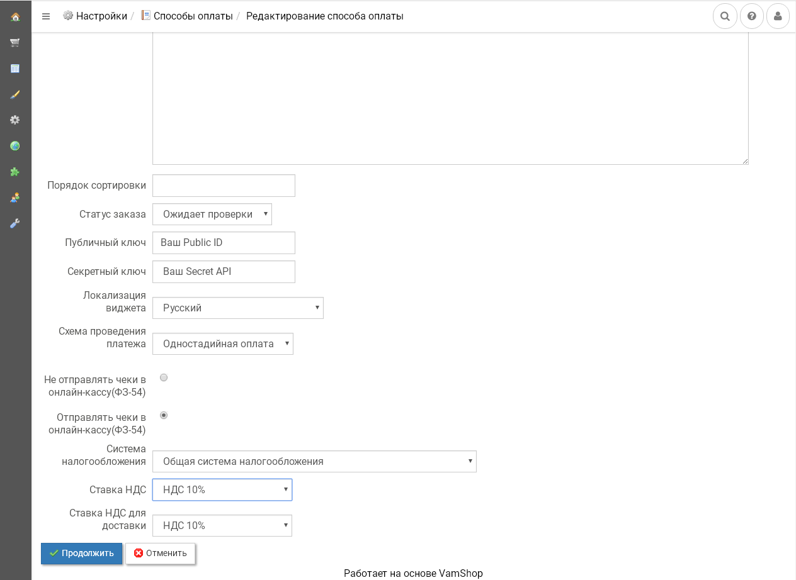
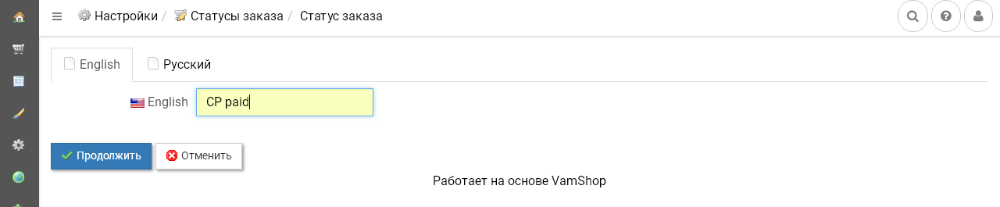
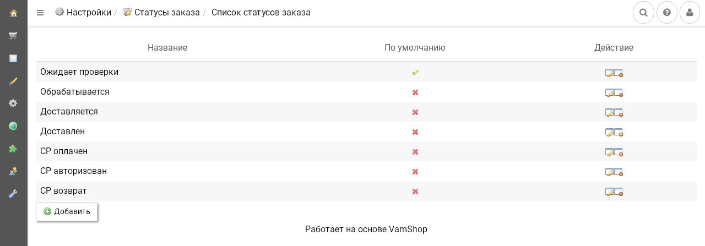

# Платежный модуль CloudPayments для Vamshop
Модуль позволит добавить на ваш сайт оплату банковскими картами через платежный сервис [CloudPayments](https://cloudpayments.ru). 
Для корректной работы модуля необходима регистрация в сервисе.

Порядок регистрации описан в [документации CloudPayments](https://cloudpayments.ru/Docs/Connect).

## Совместимость:
* VamShop 2.60 и выше.

## Возможности:  
* Одностадийная схема оплаты (SMS);
* Двухстадийная схема оплаты (DMS);
* Локализация модуля на два языка (en/ru);
* Выбор локализации платежного виджета;     
* Поддержка онлайн-касс (ФЗ-54);  
* Отправка чеков по email;  
* Отправка чеков по SMS;
* Выбор системы налогообложения;
* Выбор НДС для товаров и НДС для доставки отдельно.

## Установка

### Установка модуля
Начиная с версии [2.60](https://forum.vamshop.ru/topic/15935-новая-версия-vamshop-260/) установка не требуется, модуль уже предустановлен.  
Если модуль не установлен по умолчанию в вашей версии Vamshop, тогда для установки модуля необходимо поместить содержимое каталога **/app** из архива в соответствующий каталог на сервере.  

  
### Панель администратора Vamshop
В списке модулей (Настройки -> Способы оплаты) необходимо выбрать из списка и установить способ оплаты CloudPayments и указать следующие настройки:
* **Публичный ключ** — Public id сайта из личного кабинета CloudPayments;
* **Секретный ключ** — API Secret из личного кабинета CloudPayments;
* **Локализация виджета** — Язык виджета;
* **Схема проведения платежа** — Выбор одно- или [двухстадийной схемы проведения платежей](https://cloudpayments.ru/wiki/integration/common/payments_schemes).

При использовании интеграции с онлайн-кассой выберите опцию **Отправлять чеки в онлайн-кассу(ФЗ-54)** и установите следующие параметры:
* **Система налогообложения** — Тип системы налогообложения. Возможные значения перечислены в [документации CloudPayments](https://cloudpayments.ru/Docs/Directory#taxation-system)
* **Ставка НДС** — Указание ставки НДС. Все возможные значения указаны в [документации](https://cloudpayments.ru/Docs/Kassa#data-format)
* **Ставка НДС для доставки** — Указание ставки НДС для доставки. Аналогично ставке НДС.
После указания всех данных сохранить настройки.

В списке статусов заказа (Настройки -> Статусы заказа) необходимо добавить следующие статусы заказа:
* **CP paid** - оплачено через платежный сервис CloudPayments;
* **CP authorized** - авторизация платежа при двухстадийной схеме оплаты через платежный сервис CloudPayments;
* **CP refund** - возврат платежа, проведенного через платежный сервис CloudPayments.

Если вышеуказанные статусы не будут добавлены, статус заказа будет установлен из настроек Cloudpayments  «Статус заказа» в панели администратора.

### Личный кабинет CloudPayments
В [личном кабинете CloudPayments](https://merchant.cloudpayments.ru/login) в настройках сайта необходимо включить следующие уведомления:

* **Сheck** Уведомление (Запрос  на проверку платежа):\
`http(s)://domain.ru/vamshop/payment/cloudpayments/result/?action=check`
* **Pay** Уведомление (Уведомление о принятом платеже):\
`http(s)://domain.ru/vamshop/payment/cloudpayments/result/?action=pay`
* **Refund** Уведомление (Уведомление о возврате платежа):\
`http(s)://domain.ru/vamshop/payment/cloudpayments/result/?action=refund`
* **Confirm** Уведомление (Уведомление о подтверждении платежа, проведенного по двустадийной схеме):\
`http(s)://domain.ru/vamshop/payment/cloudpayments/result/?action=сonfirm`
* **Cancel** Уведомление (Уведомление об отмене платежа по вашей инициативе):\
`http(s)://domain.ru/vamshop/payment/cloudpayments/result/?action=сancel`
* **Fail** Уведомление (Уведомление если оплата была отклонена):\
`http(s)://domain.ru/vamshop/payment/cloudpayments/result/?action=fail`

где **domain.ru** — доменное имя вашего сайта. Во всех случаях требуется выбирать вариант по умолчанию: кодировка — UTF-8, HTTP-метод — POST, формат — CloudPayments.
